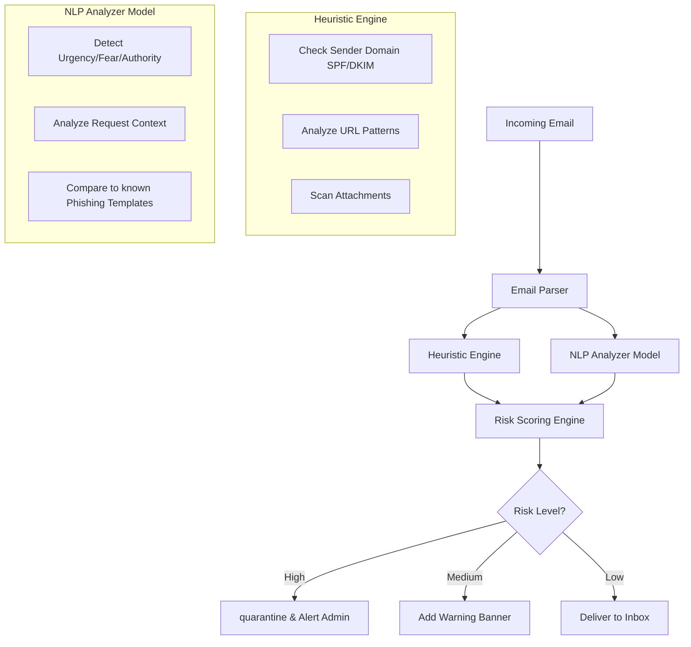

# PhishGuard AI — Project Walkthrough

**PhishGuard AI** is an open-source, AI-driven phishing email generator designed for employee security awareness training. It allows organizations to simulate realistic, parameterized phishing attacks to test and educate their workforce.

## Project Structure

- **Backend:** Flask (Python) with REST API routes.
- **AI Engine:** Google Gemini (Free Tier) + Rule-Based Fallback Engine (No API Key required).
- **Frontend:** HTML5/CSS3/JavaScript with a premium dark-themed UI.
- **Database:** SQLite (local `phishing_emails.db`) for tracking simulation history.

## How to Run locally

1.  **Install Python Dependencies:**
    ```bash
    pip install -r requirements.txt
    ```
2.  **Configure API Keys (Optional):**
    - Copy `.env.example` to `.env`.
    - Add your Google Gemini API Key if desired (app works without it).
3.  **Launch the App:**
    - Run `python app.py` or double-click `Start_PhishGuard.bat`.
    - Open `http://127.0.0.1:5000` in your browser.

---

## Future Scope: Phishing Analyzer & Detector

While the current implementation focuses on *generating* simulations, a critical future component is the **Phishing Analyzer & Detector**. This module would serve as a defensive tool to identify and flag malicious emails in real-time.

### Concept Overview

The Analyzer would ingest incoming emails and evaluate them against the same indicators used by the Generator, providing a risk score and detailed report.

### Proposed Architecture



### Key Detection Features

1.  **Language Anomaly Detection:**
    - Uses NLP to detect unusual urgency, grammar errors inconsistent with professional communication, or high-pressure tactics (e.g., "Immediate Action Required").
    - Flags emotional manipulation triggers (Fear, Greed, Curiosity).

2.  **Technical Indicator Analysis:**
    - **Header Analysis:** Verifies SPF, DKIM, and DMARC records to detect spoofed senders.
    - **URL Inspection:** Decodes obfuscated links, checks for typosquatting (e.g., `paypal-login-secure.com`), and analyzes redirect chains.
    - **Attachment Sandboxing:** Automatically scans attachments for double extensions (`.pdf.exe`) or macro-enabled documents (`.docm`).

3.  **Contextual Awareness:**
    - Analyzes the relationship between sender and recipient. (e.g., "Is the CEO emailing an intern asking for gift cards?").
    - Cross-references internal company data (e.g., checking if an "invoice" matches a known vendor).

4.  **Reporting Dashboard:**
    - A visual dashboard similar to the current Generator UI, but focused on *analysis*.
    - Shows a breakdown of why an email was flagged (e.g., "85% Confidence: Credential Harvesting Attempt").

### Integration Strategy

This module could be integrated directly into the `app.py` backend as a new endpoint:
- `POST /api/analyze` — Accepts raw email content, returns structured analysis JSON.
- The frontend would include a new "Analyzer" tab where users can paste email content to test the detection logic.
